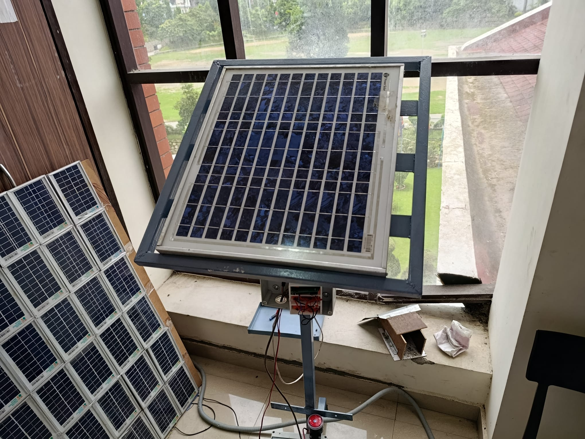
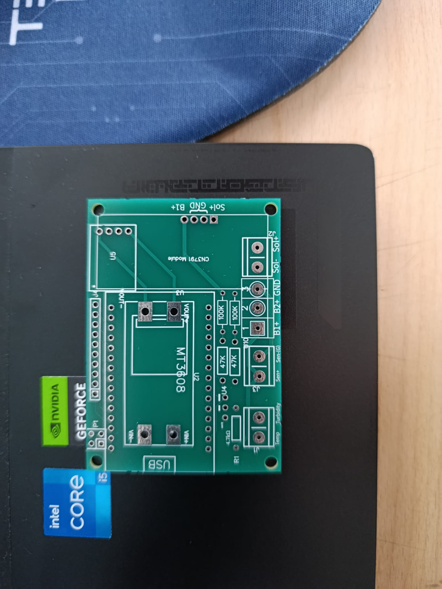
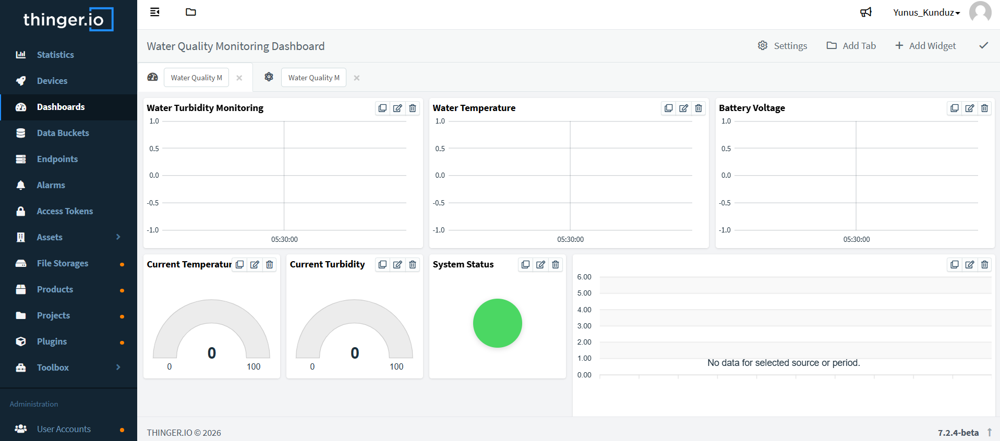
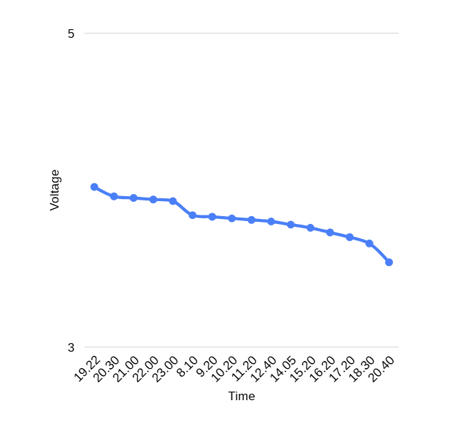
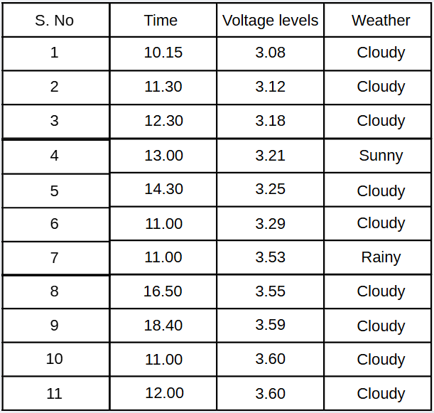

# Solar-Powered IoT System for Real-Time Water Quality Monitoring in Aquaculture 🐟📡

This repository contains the hardware architecture and embedded software source code for an IoT-based remote monitoring system designed for aquaculture facilities. The project was developed during an academic research internship at the **Department of Electronics and Communication Engineering, Graphic Era University** (Dehradun, India) in collaboration with AIESEC.

📄 **[Click here to read the full Research Paper / Project Report](Solar-Powered_IoT_System_for_Real-Time_Water_Quality_Monitoring_in_Aquaculture.pdf)**

## 📌 Project Overview
The primary objective of this project is to eliminate the need for manual on-site water quality checks in fish farms. By utilizing an **ESP32 microcontroller** integrated with turbidity and temperature sensors, the system continuously reads water quality metrics and transmits them to the **Thinger.io** cloud platform via Wi-Fi. The entire node is powered by a custom solar energy infrastructure, ensuring sustainable, off-grid, and uninterrupted remote operation.

## ⚙️ Key Features & Technologies
* **Microcontroller:** ESP32 (Wi-Fi enabled)
* **Sensors:** Analog Turbidity Sensor, DS18B20 Digital Temperature Sensor
* **Cloud IoT Platform:** Thinger.io (Real-time dashboard and data logging)
* **Power Management:** Solar panel integrated with a custom voltage divider circuit and LiPo battery backup
* **Programming:** Embedded C/C++ 

---

## 📸 System Architecture & Hardware Implementation
The hardware setup encompasses a custom-designed PCB and a solar panel infrastructure engineered for outdoor endurance.

<p align="center">
  
  
</p>

## ☁️ Thinger.io Cloud Dashboard Integration
Sensor data is securely transmitted to the cloud in real-time, providing an intuitive dashboard for the remote monitoring of the aquatic environment.

<p align="center">
  
</p>

## 🔋 Power Management & System Autonomy
To ensure sustainable off-grid operation, the system utilizes a solar panel combined with a LiPo battery backup. The power management architecture was rigorously tested for both energy generation and system endurance.

* **Battery Endurance (No-Sun Scenario):** The discharge graph illustrates the voltage drop of the LiPo battery under active system load. This test was conducted to calculate the maximum system uptime when solar energy is unavailable.
* **Solar Power Generation:** The logged data table correlates environmental weather conditions with the voltage levels generated by the solar infrastructure, ensuring the battery recharges effectively during daylight.

<p align="center">
  
  
</p>

---

## 📂 Repository Structure
* `/source`: Contains the main `.ino` / `.cpp` source files for the ESP32.
* `/assets`: Circuit schematics, PCB layout photos, and Thinger.io dashboard screenshots.
* `Solar-Powered_IoT_System_for_Real-Time_Water_Quality_Monitoring_in_Aquaculture.pdf`: The detailed methodology and official project documentation.

## 🚀 How to Use / Setup Instructions
1. Clone this repository to your local machine:
   ```bash
   git clone https://github.com/yunus-kunduz/esp32-aquaculture-iot.git
